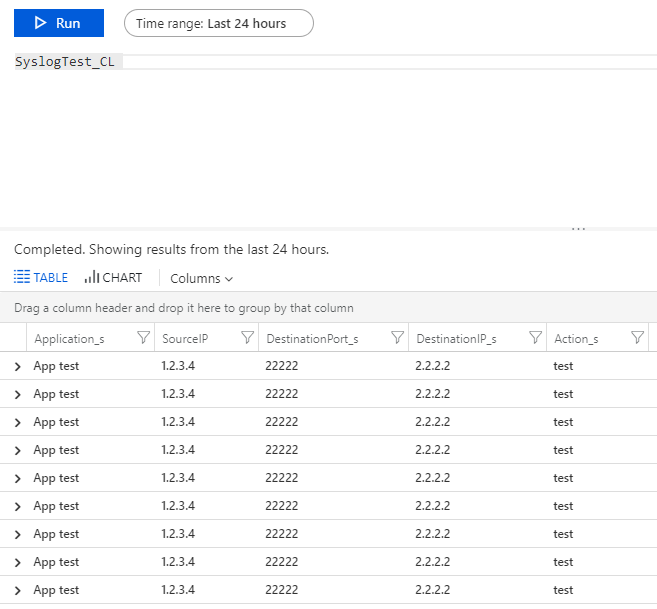

## SYSLOG TO AZURE

### Testing pysyslog.py (syslog server in python)

1) Run pysyslog.py

```
docker@R90HE73F:/mnt/c/Users/irekromaniuk/syslog2la$ python pysyslog.py

```

2) Install and run my syslog-generator

```
docker@R90HE73F:/mnt/c/Users/irekromaniuk$ echo $GOPATH
/mnt/c/Users/irekromaniuk/GolangProjects
docker@R90HE73F:/mnt/c/Users/irekromaniuk$ go get github.com/IrekRomaniuk/syslog-generator

docker@R90HE73F:/mnt/c/Users/irekromaniuk$ $GOPATH/bin/syslog-generator -ip="localhost" -port="6514" -protocol="udp"
^C
```

3) View log file

```
docker@R90HE73F:/mnt/c/Users/irekromaniuk$ head syslog2la/logfile.log
<141>December 10 17:20:56 R90HE73F 1,2018/10/12 17:20:56,001901000999,threat,file,1,2018/10/12 17:20:57,1.2.3.4,2.2.2.2,0.0.0.0,0.0.0.0,G0s9J4jAU3,me,you,App test,vsys1,src,dst,ae1.100,ae2.200,LF-elk,2018/10/12 17:20:58,33891243,1,11111,22222,0,0,0x0,tcp,test,Test,This is test only,any,low,server-to-client,5210010,0x0,10.10.10.0-10.255.255.255,10.20.20.20-10.255.255.255,0,,,,,,,,,,,,,
```

### Testing csv2la.py (csv file to Azure Log Analytics)

```
docker@R90HE73F:/mnt/c/Users/irekromaniuk/syslog2la$ python csv2la.py
Accepted
```


### Testing syslog2la.py

```
docker@R90HE73F:/mnt/c/Users/irekromaniuk/syslog2la$ python syslog2la.py
('111.222.3.4', '2.2.2.2', '22222')
Accepted
('111.222.3.4', '2.2.2.2', '22222')
Accepted
('111.222.3.4', '2.2.2.2', '22222')
Accepted
```

### Dockerize

```
docker build -t syslog2azure .
docker run -d --name syslog2azure -p 6514:6514 syslog2azure
docker login
docker tag syslog2azure irom77/syslog2azure
docker push irom77/syslog2azure
```
